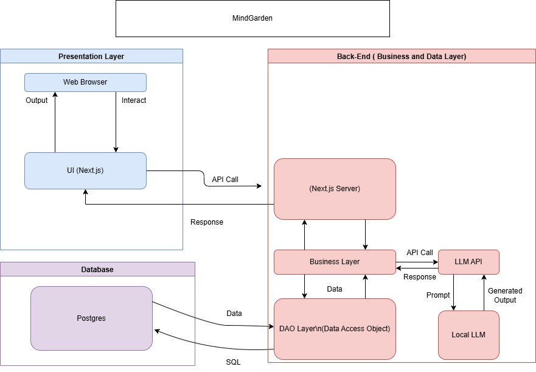

# Mind Garden

## Meet the Contributors

| **Name**                  | **Github Username** |
| ------------------------- | ------------------- |
| Ji Min Ryu (Group Leader) | @jiminryuu          |
| Manisha Gurukumar         | @gmanishaa          |
| Hassan Khan               | @hkhan701           |
| Caroline Nieminen         | @cnieminen          |
| Aiden Park                | @orca277            |
| Colm Ukrainec             | @colmukrainec       |

# Project Proposal

## Vision

At Mind Garden, our mission is to cultivate a space where personal growth and mindfulness flourish through intuitive, data-driven tools. We empower users to nurture healthy habits, reflect deeply, and unlock their potential by seamlessly integrating habit tracking, journaling, and productivity tools into one cohesive experience.

## Summary

Building the habit of self-improvement through journaling can be tough, but Mind Garden is here to help. Mind Garden is a comprehensive space for bettering your mental well-being. It is somewhere to journal, record daily tasks, and track habits to understand how they affect the user’s mental health. The goal of Mind Garden is to simplify the process of consistent journaling and habit tracking. We hope the app gives the user insights into their patterns and helps them achieve their personal goals.

Long-term, we hope that Mind Garden supports the younger generation through their mental health journey. To address the challenge of staying consistent with journaling and habit tracking, we are integrating features like notifications, streaks, and badges. Along with that, we want our user experience to be simple and effective while ensuring all essential information is easily accessible.

We are looking to see a consistent growth of 10% each month. Since consistency is important when it comes to personal development, we hope to see at least 30% of our users use the app daily. By reaching these goals, we can determine that our app was successful.

## Stakeholders

Mind Garden is designed for individuals who want to cultivate mindfulness, track their habits, and enhance personal growth. While young adults looking to build a journaling habit are a key audience, the platform is suitable for:

- **Students & Professionals** – Those looking to manage their daily tasks, reflect on their progress, and maintain healthy habits.
- **Productivity Seekers** – People who want to optimize their routines, set goals, and track their achievements through habit tracking and AI-powered task management.
- **Coaches & Therapists** – Professionals who encourage journaling and habit-building as part of mental health or life coaching practices.

Of course, Mind Garden is suitable to any age, though, if they have a genuine interest in personal development.

## Main Features

Our core features for Mind Garden are the ability to create an account, voice-made daily tasks, daily data intake, a journal entry system, data visualization, and achievement progress tracking.

- **Create an account:** The user should have the ability to create an account, so the data can follow the user to whatever device they wish to use.
- **Voice-made daily tasks:** At the start of each day, the user can record themselves discussing what needs to be accomplished that day. Mind Garden will then narrow the information down into a simple bullet point list to ensure the user stays on track for the day.
- **Daily data intake:** At the end of each day, the user will be expected to input data relating to the habits they wish to track. This can be something like how much water they drank or how much sleep they got the night prior.
- **Journal entry system:** Along with the daily data intake, the user will be prompted to write in their digital journal. Here, they can either express their feelings freely or use the provided guided questions.
- **Data visualization:** The data from the daily input and journal entries can then be used for data visualization where the user can view their habit patterns and how that might relate to their mood. Summaries from both the daily input and journal entries will be made possible using AI.
- **Reminders:** As the user engages with Mind Garden, they will have the option to set personalized reminders to help them maintain their daily routines and keep consistency. The reminders will be sent via email and users can customize these reminders to only include specific features they wish to be reminded of or turn them off if they prefer.

Our application can respond to 20 users with a total of 200 requests per minute concurrently.

## Technologies

For this project, we are leveraging modern technologies to ensure scalability, maintainability, and performance.

- **Programming Language & Framework**
  - We chose **TypeScript** for its type safety, which helps reduce bugs and improve code reliability.
  - Our framework of choice is **Next.js**, which will be used for both the front-end user interface and back-end server-side logic.
- **Database & Authentication**
  - We are using **Supabase**, a **PostgreSQL**-based solution, due to its scalability, generous free tier, and built-in authentication via **Supabase Auth**, which simplifies user authentication and management.
- **AI Integration**
  - We plan to integrate AI into our project using a local **LLM (Llama)** with an API developed in-house to enhance our features.
- **Hosting & Infrastructure**
  - For hosting, we are evaluating **Microsoft Azure** and **AWS** to determine the best fit for our needs.
  - **Docker** will be used for containerization, ensuring a seamless deployment process.
  - **GitHub Actions** will handle CI/CD to automate testing and deployment.
- **Code Quality & Standards**
  - We will enforce consistent coding standards using **ESLint**, ensuring a clean and maintainable codebase.

## User Stories

1. **Account Creation & Management**
   - **As a user, I want to be able to create an account so that I can keep my records.**
     - On a registration page, when a user enters a valid email address, password, and any required fields, and clicks "Sign Up", the account is created, and the user is redirected to the welcome page/dashboard. When the user enters an already registered email address and submits the form, the system displays an error message stating the email is already in use.
   - **As a user, I want to be able to access my account so that I can view any records I made.**
     - When the user has entered their registered email and password and the credentials are correct, the user is logged in and redirected to the dashboard. When the user enters incorrect credentials and the login form is submitted the system displays an error message indicating an incorrect email or password.
   - **As a user, I want to be able to reset my password without logging in so that even if I forget my password I can still recover my account.**
     - When the user clicks on "Forgot Password" from the login page and the user provides their registered email address, the system sends a password reset email with a unique link to that address. When the user enters and confirms a new password and the new password meets the system's security requirements, the password is updated, and the user is redirected to the login page with a success message.
   - **As a user, I want to be able to change the credentials of my account so that in case my information changes I can correct it.**
     - When the user is logged in and navigates to the account settings and requests to update email, password, or etc., the system prompts the user to enter the current password for verification. When the user enters new credentials and submits the changes, the system updates the credentials and displays a success message.
   - **As a user, I want to be able to delete my account so that all records that I've made are deleted.**
     - When the user is logged in and navigates to the account settings and clicks on "Delete Account", the system should ask for confirmation to ensure they want to permanently delete the account. If the user confirms the deletion request, the account and all associated data are permanently deleted from the system. After deletion, the user is logged out and redirected to the homepage. A confirmation email is sent to the user notifying them that their account has been deleted.
2. **Daily Data Intake**
   - **As a user, I want to be able to track multiple habits so that I can monitor my progress and goals.**
     - Given that I am a logged-in user, when I open the “habit tracker” page, then the system shows me all of my habits and allows me to visually fill out whether or not I successfully completed it that day (colored in day for complete).
   - **As a user, I want to be able to rate my day on a scale from 1 to 5, so that I can get an at-a-glance view of the quality of my day.**
     - Given that I am a logged-in user, when I open the "habit tracker" page, then the system allows me to rate my day on a scale from 1 to 5 and submit with my tracked habits
   - **As a user, I want to be able to track my sleep so that I can understand my sleep patterns and improve my well-being.**
     - Given that I am a logged-in user, when I open the “sleep tracker” page, then the system allows me to fill in information about my sleep and also allows me to view information on days prior.
3. **Journal Entry System**
   - **As a user, I want to create a journal entry so that I can document my thoughts throughout the day.**
     - Given that I am a logged-in user, when I am on the homepage then the system shows me a journal entry portion of the screen and when I click create new entry then the system shows me an empty page that I can write in.
   - **As a user, I want guidance for my journal entry in the form of prompts so that my ideas are better organized.**
     - Given that I am a logged-in user already in the new journal entry, when I click on the options button and I click on guided journaling then I can see a prompt for me to write about above the empty page.
   - **As a user, I want to be able to view my past journal entries so that I can reflect on my progress.**
     - Given that I am a logged-in user, when I am on the homepage then the system shows me a journal entry portion of the screen and when I click view past journals then the system shows me all of my past journal entries with their dates.
   - **As a user, I want to be able to edit my journal entry so that I can update my thoughts throughout the day.**
     - Given that I am a logged-in user and already viewing my past journal entries, when I click on the edit button next to the journal entry then the system opens up that journal entry with text already in it and allows me to make changes.
   - **As a user, I want to be able to delete my journal entry so that I can remove any content I do not want anymore.**
     - Given that I am a logged-in user and already viewing my past journal entries, when I click on the delete button next to the journal entry then the system removes the entry and I can no longer view it.
4. **Voice-Made Daily Tasks**
   - **As a user, I want to be able to speak and annotate my voice for the AI to summarize it so that I can quickly capture my thoughts and convert them into actionable tasks.**
     - Given that I am a logged-in user, when I click the tasks menu on the homepage, and I click the "Record Now" button, then the system allows me to record my voice and transcribe it in real-time.
   - **As a user, I want to be able to add a task manually if I do not want to use the AI.**
     - Given that I am a logged-in user, and viewing my list of tasks, when I click the "Add Task" button, then the system shows an input field to add a new task.
   - **As a user, I want to be able to delete a task so that I can keep my task list relevant, or if I make a mistake.**
     - Given that I am a logged-in user, and that I am viewing my task list, when I click the "Delete" button next to a task, then the system removes that task, and I will no longer be able to view it.
   - **As a user, I want to be able to see previously uncompleted tasks so that I can review and prioritize tasks that were not completed on days that they were created.**
     - Given that I am a logged-in user, and that I am viewing my task list, when I have not completed a task from yesterday, it will show up under "Previously uncompleted items".
   - **As a user, I want to be able to mark tasks as complete, so that I can track my progress and stay motivated.**
     - Given that I am a logged-in user, and that I am viewing my task list, when I click the checkbox button next to a task, then the task is visually marked as complete (strikethrough text).
5. **Reminders**
   - **As a user, I want to be able to set the time for my reminders so that they align with my schedule.**
     - Given that I am a logged-in user, when I navigate to the notifications page, then the system displays an interface where I can set specific times for different reminders, such as daily habit tracking, journaling, and general check-ins.
   - **As a user, I want to receive reminders if I have not completed my habit tracker or journal entry by a certain time so that I am prompted to stay consistent.**
     - Given that I am a logged-in user, when I have not filled out my daily habit tracker or created a journal entry by my designated time, then the system sends a reminder notification prompting me to complete these tasks.
   - **As a user, I want to receive reminders if I have not opened the app in a full day so that I do not lose track of my progress.**
     - Given that I am a logged-in user, when I have not accessed the application for 24 hours, then the system sends a reminder notification encouraging me to log in and continue my progress.
   - **As a user, I want to receive reminders in a clear and easy-to-read format so that I can understand the purpose at a glance.**
     - Given that I am a logged-in user, when I receive a reminder notification via email, the message includes a clear subject, a brief and friendly reminder text, and direct links to the relevant section of the app (e.g., habit tracker, journal entry).
   - **As a user, I want to be able to disable reminders for specific tasks, or altogether, so that I can customize my notification preferences.**
     - Given that I am a logged-in user, when I navigate to the notifications page, then the system displays an interface where I can toggle reminders on or off for specific tasks, such as habit tracking, journaling, and task completion.
6. **Data Visualization**
   - **As a user, I want to view my habits in a heat map so that I can quickly identify patterns in my habit tracking.**
     - Given that I am a logged-in user and on the habit tracker page, when I select the "Heat Map" view, the system displays a color-coded calendar where completed habits are highlighted with different intensities based on consistency.
   - **As a user, I want to see my longest streak for a habit so that I can track my best performance.**
     - Given that I am a logged-in user and on the habit tracker page, when I select a habit, the system displays the longest number of consecutive days I have completed it.
   - **As a user, I want to see my current streak so that I can stay motivated to maintain consistency.**
     - Given that I am a logged-in user and on the habit tracker page, when I select a habit, the system displays the number of consecutive days I have completed it without breaking the streak.
   - **As a user, I want to see my habits in a calendar view so that I can track my progress over time.**
     - Given that I am a logged-in user and on the habit tracker page, when I select the "Calendar View," the system displays a monthly calendar where each day is marked based on my habit completion.
   - **As a user, I want to view progress charts for my habits so that I can analyze my improvement over time.**
     - Given that I am a logged-in user and on the analytics dashboard, when I select a habit, the system displays a line graph showing my completion trend over weeks or months.
   - **As a user, I want to see my task completion trends in a bar chart so that I can track my productivity.**
     - Given that I am a logged-in user and on the analytics dashboard, when I select "Task Completion," the system displays a bar chart showing the number of tasks I completed each day over the past month.
   - **As a user, I want to see my journaling activity in a visual format so that I can reflect on how often I write.**
     - Given that I am a logged-in user and on the analytics dashboard, when I select "Journaling Activity," the system displays a graph indicating the number of journal entries I have made over time.
   - **As a user, I want to compare my habits, journal entries, and task completion side by side so that I can identify correlations.**
     - Given that I am a logged-in user and on the analytics dashboard, when I choose multiple data points, the system overlays charts to help visualize relationships between habits, journaling, and tasks.

## Architecture Diagram



Creating .env file

```bash
cp .env.sample .env
```

Run the development server:

```bash
npm run dev
# or
yarn dev
# or
pnpm dev
# or
bun dev
```

Open [http://localhost:3000](http://localhost:3000) with your browser to see the result.

You can start editing the page by modifying `app/page.tsx`. The page auto-updates as you edit the file.

This project uses [`next/font`](https://nextjs.org/docs/app/building-your-application/optimizing/fonts) to automatically optimize and load [Geist](https://vercel.com/font), a new font family for Vercel.

## Learn More

To learn more about Next.js, take a look at the following resources:

- [Next.js Documentation](https://nextjs.org/docs) - learn about Next.js features and API.
- [Learn Next.js](https://nextjs.org/learn) - an interactive Next.js tutorial.

You can check out [the Next.js GitHub repository](https://github.com/vercel/next.js) - your feedback and contributions are welcome!

## Deploy on Vercel

The easiest way to deploy your Next.js app is to use the [Vercel Platform](https://vercel.com/new?utm_medium=default-template&filter=next.js&utm_source=create-next-app&utm_campaign=create-next-app-readme) from the creators of Next.js.

Check out our [Next.js deployment documentation](https://nextjs.org/docs/app/building-your-application/deploying) for more details.

Architecture Diagram


## CodeQL Setup

Setting up code scan/code review

1. Go to GitHub repository’s security tab
2. Go to Code Scanning submenu
3. Modify the settings to preferences

## Running Tests Using Jest

1. Create a file named \*.spec.ts, for example `dbfunctions.spec.ts`
2. Write in the tests you desire to run
3. In the CLI type, `npx jest 'dbfunctions.spec.ts'`
4. If you wish to run it with test coverage type, `npx jest --coverage 'dbfunctions.spec.ts'`
5. If you wish to run it with test coverage for a specific directory type, `npm run test:coverage --path='x'` where `x` is the directory for your test file, i.e. `'src/utils/supabse'`
